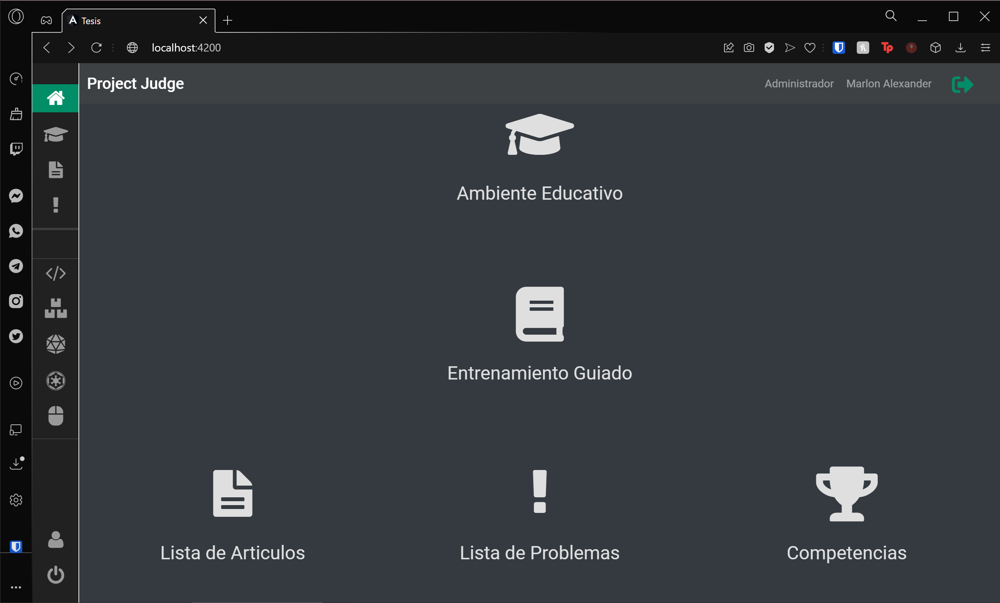
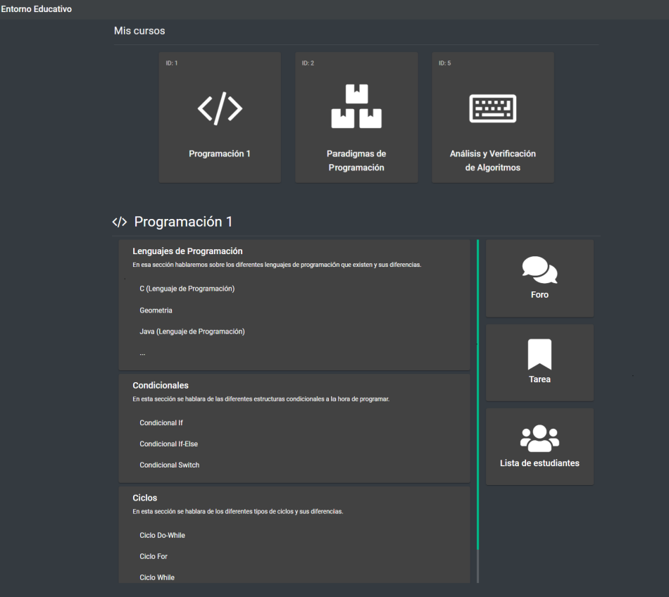
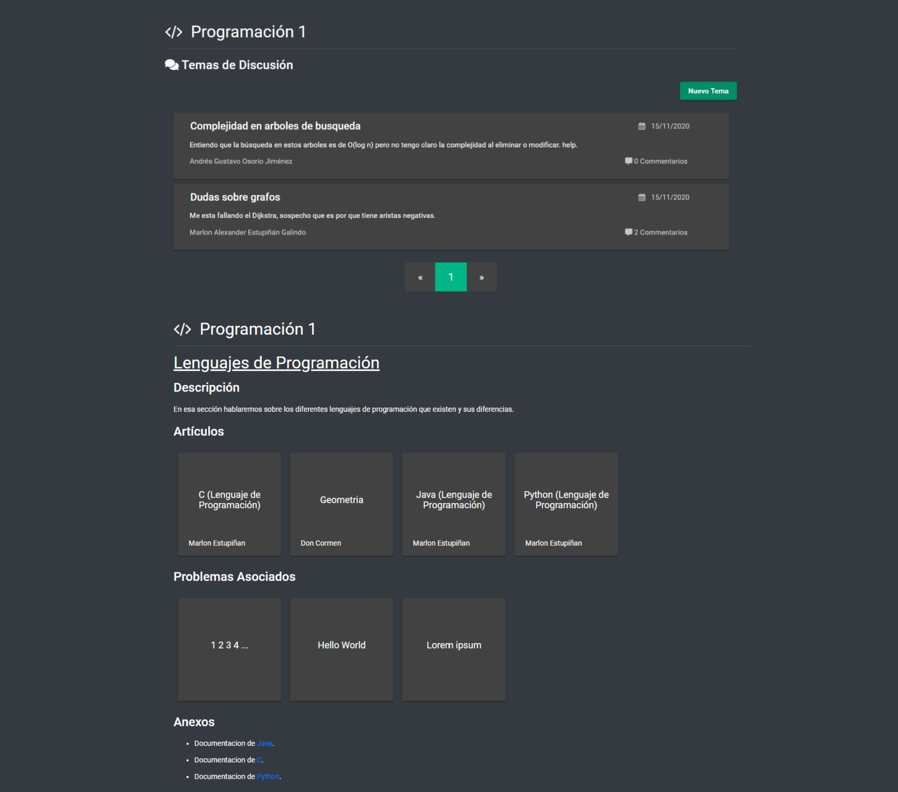
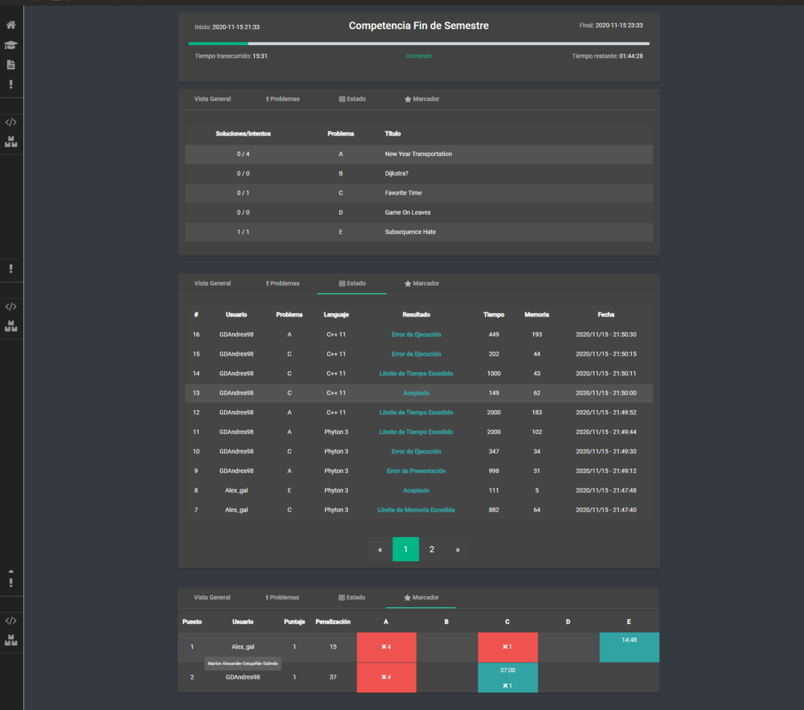
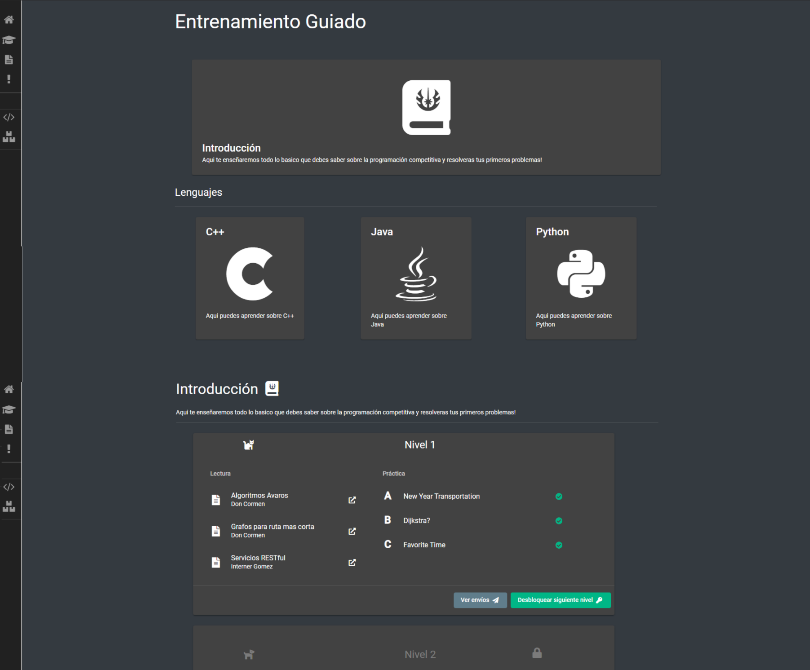
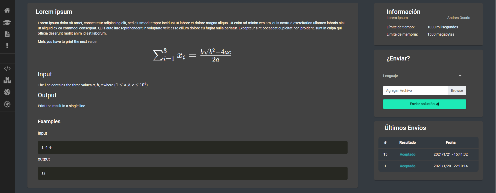
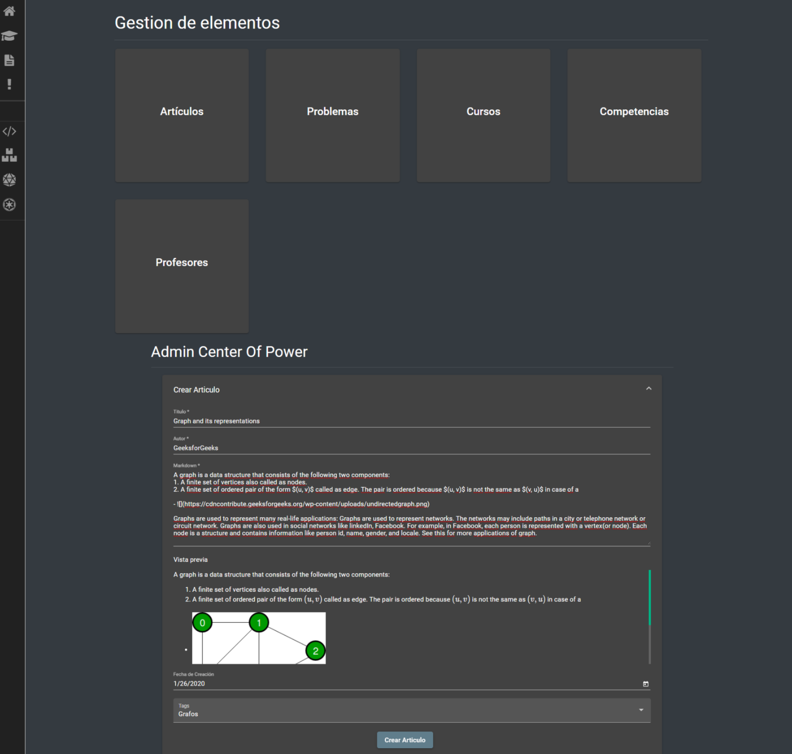

# Muestra de App

Extracto del trabajo de grado [Diseño e implementación de un prototipo de plataforma de apoyo al aprendizaje de la programación de computadores y la algoritmia para los programas de ingeniería del Politécnico Grancolombiano](https://github.com/GDAndres98/App-MA-Frontend/blob/master/doc/Tesis%20Marlon%20Andres.pdf)

## Resultados

Una vez completada la aplicación, y relacionando los objetivos, es posible evidenciar de forma específica el cumplimiento de estos ya que existen grandes núcleos en los que se basa la aplicación.

Podemos ver entonces que hay tres componentes fundamentales del sistema, el Ambiente Educativo, un apartado para Competencias y el Entrenamiento Guiado para usuarios menos experimentados.

### **Ambiente Educativo**
Aquí podemos encontrar un sistema de gestión de aprendizaje (LMS), en donde los estudiantes y los tutores de distintos cursos pueden interactuar mediante un foro de discusión, sugerencias de artículos y actividades y la asignación de problemas de programación competitiva como tareas.

Se muestra entonces una plataforma alternativa donde el docente puede gestionar de manera cómoda el curso, creando y organizando una serie de secciones en donde puede agregar artículos y problemas del repositorio de la aplicación, del mismo modo tiene el gestor de tareas donde puede administrar las calificaciones de los estudiantes de la clase.

### **Competencias**
Una vez el creador de contenido (administrador) organice las competencias, los usuarios podrán encontrar un sistema de competencias de programación competitiva tradicional en el cual pueden tener información básica de esta tal como su nombre, tiempos de inicio y finalización y estado como lo fundamental; una vista previa de los problemas, estado de los envíos de los usuarios participantes y su respectiva tabla de clasificación.

Se implementó entonces, para la comunidad de programación competitiva, una plataforma de competencias que puede ser organizada para los usuarios de esta, a partir de problemas subidos al sistema

### **Entrenamiento Guiado**
Aquí los usuarios pueden encontrar una guía gamificada y lineal de distintos temas de los que un usuario pueda mostrar interés. Cada nivel está conformado por artículos relacionados a problemas que el usuario debe solucionar para avanzar al siguiente nivel.

A través de esto se busca fomentar de forma atractiva, para los usuarios más nuevos, el aprendizaje de algoritmia y la resolución de problemas mediante la programación. 

### **Artículos y Problemas**

Para la plataforma se creó todo un sistema que pudiera albergar tanto un repositorio de artículos como uno de problemas, esto con el motivo de que tanto cursos creados por docentes, el sistema de competencias y entrenamiento guiado puedan consumir estos.

A través de esto se busca fomentar de forma atractiva, para los usuarios más nuevos, el aprendizaje de algoritmia y la resolución de problemas mediante la programación.

Estos problemas y artículos son procesados por Markdown y Latex para una experiencia
más agradable de lectura y un fácil entendimiento para el usuario

### **Creador de contenido**

A usuarios definidos del sistema se le puede asignar el rol de Administrador, el cual aparte de tener la capacidad de asignar roles a docentes y organizar competencias, es el creador de contenido para la creación, edición y eliminación de Artículos, Problemas y Cursos.

